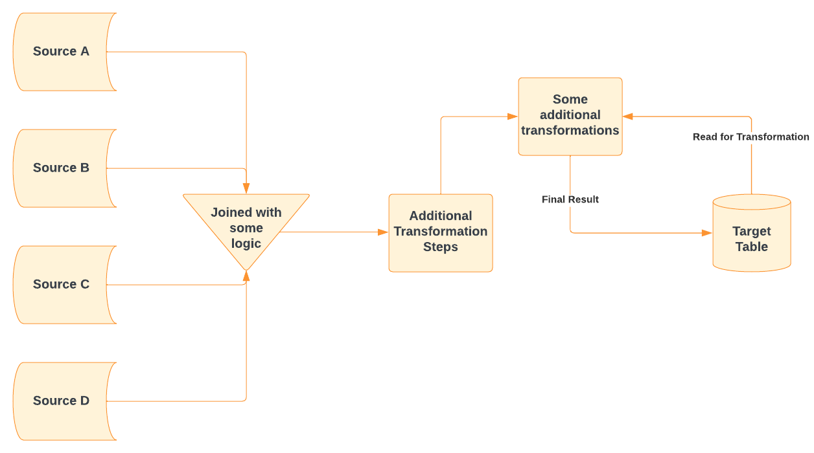

# Performance Enhancement

## **Overview**

One of the ETLs in production was paused due to a performance issue.
This presented an opportunity to work on fine-tuning the performance. Numerous approaches 
in this documentation is discussed without giving out the intricacies of the ETL.

## **ETL Architecture**


## **Approaches**
Though multiple approaches were tried, we will discuss the best practices that fit the need.
The methods discussed are more relevant to the problem at hand, as every scenario is different. 
It's important to know that choosing an approach based on the overall architecture will provide the best results.

### ***Repartitioning Target table:*** [PySpark Doc-repartition](https://spark.apache.org/docs/3.1.1/api/python/reference/api/pyspark.sql.DataFrame.repartition.html)
As discussed in the architecture, the target table which is read for performing some transformations
by joining with the source data frames, repartitioning the target table showed significant improvement
in the overall execution time. 
Although ***Spark repartition is considered to be expensive as it involves shuffling of data***, this 
was implemented as it was believed to ease the join condition in the long run.
```commandline
df.repartition(numPartitions, *cols)
```
 


***Suggessted optimal alternative- coalesce()*** 
An alternative approach if there is a need for repartitioning the dataframe with minimal shuffling of
data.
```commandline
df.coalesce(numPartitions)
```
[PySpark Doc-coalesce](https://spark.apache.org/docs/3.1.1/api/python/reference/api/pyspark.sql.DataFrame.coalesce.html)

It's important to keep in mind that repartitioning dataframes on unique columns such at date-key may
result in a ***small file problem*** 


### ***Broadcast join:*** [PySpark Broadcast join](https://spark.apache.org/docs/3.1.3/api/python/reference/api/pyspark.sql.functions.broadcast.html)
The source data frames(smaller than the target table) had to be joined to the newly partitioned target table for 
some transformations. Since this resulted in a ***small data frame - large data frame*** scenario, the immediate approach was 
to broadcast the smaller dataframe- as this may reduce data shuffling.


Although on paper this approach seemed a feasible option, it turned out not to be viable since no significant
boost in terms of performance was observed.


### ***Cache or Persist:***
This approach showed significant improvement in performance and complemented the repartitioning of the target table. After extracting the source data frames and joining them, 
numerous transformations were in place which increased the logical query plan for execution. Therefore, after analyzing the logical plan of the data frame, as the sources were used 
repeatedly, caching the dataframe before performing additional transformations reduced the logical plan considerably.


```commandline
df.explain(exteded=False)
Note: extended can be used to get the physical plan
```
[PySpark df.explain()](https://spark.apache.org/docs/3.1.2/api/python/reference/api/pyspark.sql.DataFrame.explain.html)

This article highlights how Spark leverages caching- [Towards Data Science](https://towardsdatascience.com/best-practices-for-caching-in-spark-sql-b22fb0f02d34)

It's important to know that caching the data frame is still a cost and hence may result in failures due to **out of memory exception**
if used for more extensive data frames.

Note: Since Spark uses lazy evaluation, in order to leverage the optimization techniques for a transformation, an action needs to be performed- such as collect(), count() etc

### ***withColumn() v/s select():***
withColumn returns a ***new Data Frame***, used for adding or replacing an existing column.
Using this method iteratively to add or modify multiple columns may result in substantial query plans 
which reduces overall performance. Instead, a better approach would be to use the select statement, even for multiple columns,
which still returns a new data frame. 
Although on fewer columns, it is challenging to measure the difference in performance, this would still
be an optimal approach in the long run.
[PySpark withColumn()](https://spark.apache.org/docs/3.1.3/api/python/reference/api/pyspark.sql.DataFrame.withColumn.html)

- Captures difference between the two-[stackoverflow](https://stackoverflow.com/questions/59789689/spark-dag-differs-with-withcolumn-vs-select)


## **Conclusion**

The approaches discussed above are some optimization techniques that best suited the problem
at hand. A key strategy that will increase performance is figuring out- ***how to reduce data shuffle?***

More guidelines are provided in the official Spark documentation- [Performance Tuning](https://spark.apache.org/docs/latest/sql-performance-tuning.html).
As discussed earlier, performance tuning is a huge challenge, and understanding the data, architecture, and business goals are some 
nuances that will help you choose optimal approaches.